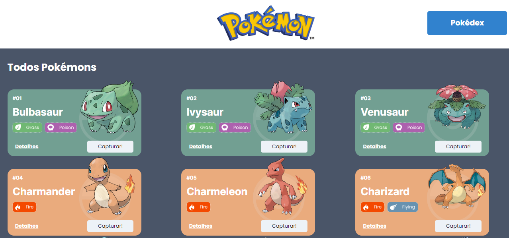

# Projeto Pokédex


Uma pokédex feita com a utilização da api pública Pokédex.

## Índice

- <a href='#tecnologias-utilizadas'>Tecnologias utilizadas</a>
- <a href='#funcionalidades'>Funcionalidades</a>
- <a href='#demonstração'>Demonstração</a>
- <a href='#rodar'>Como rodar este projeto ?</a>
- <a href='#autor'>Autor</a>


## Tecnologias utilizadas

1. React
2. Design System
3. React Router
4. Styled components


## Funcionalidades

-[x] Tela de todos os pokémons

-[x] Tela da Pokédex

-[x] Tela de detalhes de cada pokémon

-[x] Possivel adicionar e remover pokémons da pokédex

## Demonstração

[Link demonstração](taboo-plough.surge.sh)


## Como rodar este projeto ?
```bash
# Clone este repositorio
$ git clone linkrepo

#Acesse a pasta do projeto no seu terminal
$ cd pokedex-barbosad-luizdirceu

# instale as dependencias 
$ npm install

# Execute a aplicação
$ npm run start

# A aplicação será iniciada na porta 3000, acesse pelo navegador: http://localhost:3000
```
## Autor


# Luiz Dirceu marques Júnior

- Sou Desenvolvedor full stack em formação pelo bootcamp de desenvolvimento web full stack da Labenu, onde realizo projetos práticos índividuais e em grupo utilizando as tecnologias HTML, CSS e Java Script e React.

[Linkedin](https://www.linkedin.com/in/luiz-dirceu-marques/)
